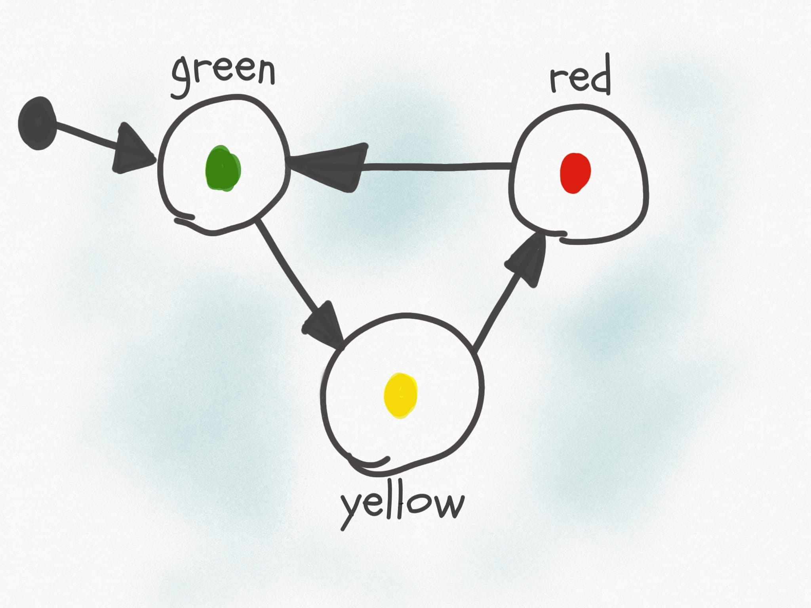

# Finite State Machine Implementation



## Overview
This project is an implementation of a Finite State Machine (FSM) in Java, using object-oriented programming principles. The FSM supports:

- State management
- Transition validation 
- Word processing 
- Input handling 
- Automated unit testing using JUnit

## Features
- **State & Transition Management:** Define states and valid transitions dynamically.
- **Input Processing:** Check if a given input string is accepted by the FSM.
- **Validation:** Ensures valid transitions and prevents duplicate transitions.
- **Unit Testing:** Includes JUnit tests for transition validity and FSM correctness.

## Installation & Setup

### Prerequisites
- Java 11+ 
- JUnit 5 (for running tests)

### Clone Repository
```sh
git clone https://github.com/melikeselma/FiniteStateMachine.git
cd FiniteStateMachine
```

### Compile and Run
```sh
javac *.java
java Main
```

### Running Tests
```sh
mvn test
```

OR

```sh
javac -cp .:junit-5.jar *.java
java -cp .:junit-5.jar org.junit.runner.JUnitCore FiniteStateMachineTest
```

## Usage
### Define States

```java
State A = new State("A");
State B = new State("B");
```

### Create FSM

```java
ArrayList<State> states = new ArrayList<>(List.of(A, B));
ArrayList<Character> inputs = new ArrayList<>(List.of('0', '1'));
ArrayList<State> initStates = new ArrayList<>(List.of(A));
ArrayList<State> finalStates = new ArrayList<>(List.of(B));
FiniteStateMachine fsm = new FiniteStateMachine(states, inputs, initStates, finalStates);
```

### Assign Transition

```java
fsm.assign(new Transition(A, B, '0'));
fsm.assign(new Transition(B, A, '1'));
```

### Validate Input String
```java
boolean result = fsm.check("010");
System.out.println("Accepted: " + result);
```

## Testing
```java
@Test
public void Test_InputOfTransitionIsNotValidForFSM_ReturnsInvalidTransition() {
    Assertions.assertThrows(InvalidTransition.class, () -> {
        fsm.assign(new Transition(A, B, '2'));
    });
}
```

## Contributing
Pull requests are welcome! Please ensure your code is well-documented and tested before submitting.

## License
This project is licensed under the MIT License.